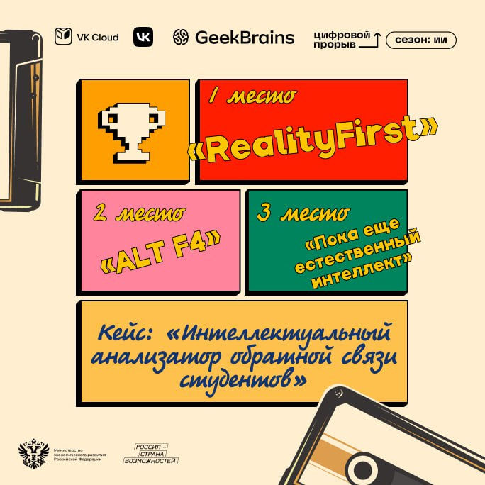
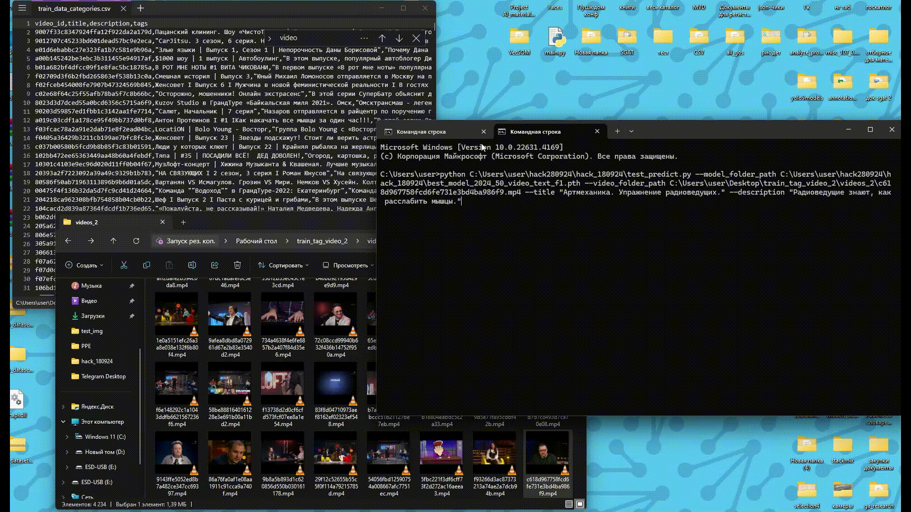

# 🚀 Хакатон: «Цифровой прорыв. Сезон: Искусственный интеллект» 🤖

# 📌 Кейс: Интеллектуальный анализатор обратной связи студентов

## 🎯 Команда: Пока еще естественный интеллект 🧠

---

<table>
<tr>
<td align="left" width="50%">

### 🏆 Место: **3**  
📍 **Окружной хакатон Центрального федерального округа 2024 года**  
🔗 [Ссылка на мероприятие](https://hacks-ai.ru/events/1077374)

### 📖 Описание кейса:
💡 Разработка чат-бота для  
детализированного анализа и  
категоризации обратной связи  
от студентов после вебинаров.  

### 👥 Участники команды:
- [Константин Кожин](https://github.com/konstantinkozhin) — **Руководитель команды, Backend-разработчик;**  
- [Павел Шерстнев](https://github.com/sherstpasha) — **Data Analyst, Data Scientist;**  
- [Владислава Жуковская](https://github.com/vlada2025) — **Дизайнер;**  
- [Михалев Антон](https://github.com/asmikhalev) — **Data Scientist, ML-разработчик.**  

</td>
<td align="center" width="50%">

</td>
</tr>
</table>

---

# 📌 Описание решения

## 🔹 Общая концепция
Данное решение включает в себя чат-бот для сбора обратной связи от студентов, модель нейронной сети для классификации отзывов по трем составляющим:
1. **Информативность**  
2. **Направленность**  
3. **Эмоциональная окраска**  

Также разработан **дашборд** для визуального анализа результатов интеллектуального анализа обратной связи.

## 🎥 Screencast (Демонстрация решения)
Посмотрите короткий **[видеоролик](Screencast.mp4)** с демонстрацией функционала чат-бота, классификации отзывов и анализа данных в дашборде.

---

## 📊 Дашборд
Дашборд имеет **понятный пользовательский интерфейс** и включает следующие функции:
- **Визуализация** результатов интеллектуального анализа;
- **Гибкая настройка графиков** под конкретные запросы пользователей;
- **Интерпретация данных** для принятия **обоснованных решений**.

Дашборд реализован на **Django**.

## 🤖 Чат-бот
Бот реализован для мессенджера **Telegram** на библиотеке **python-telegram-bot** и оснащен **интерфейсом для задания открытых вопросов и сбора ответов студентов**.

📌 **Инструкцию по запуску Telegram-бота см. в [README_BOT.md](README_BOT.md)**.

## 🧠 Модель нейронной сети
Для классификации отзывов используется **предварительно обученная модель [CANINE-C](https://huggingface.co/google/canine-c)**, разработанная Google.  
Вместо стандартных выходных слоев добавлены **кастомные классификаторы**, обученные на трех задачах:  
1. **Информативность**  
2. **Направленность**  
3. **Эмоциональная окраска**  

📌 **Детали обучения нейросети см. в [README_NET.md](README_NET.md)**.

## 🛠 Технологический стек
- **Язык программирования:** Python 🐍  
- **Библиотеки и фреймворки:**  
  - **Pytorch** — для построения нейросети  
  - **FastAPI** — для развертывания сервиса  
  - **python-telegram-bot** — для работы с Telegram API  

---
